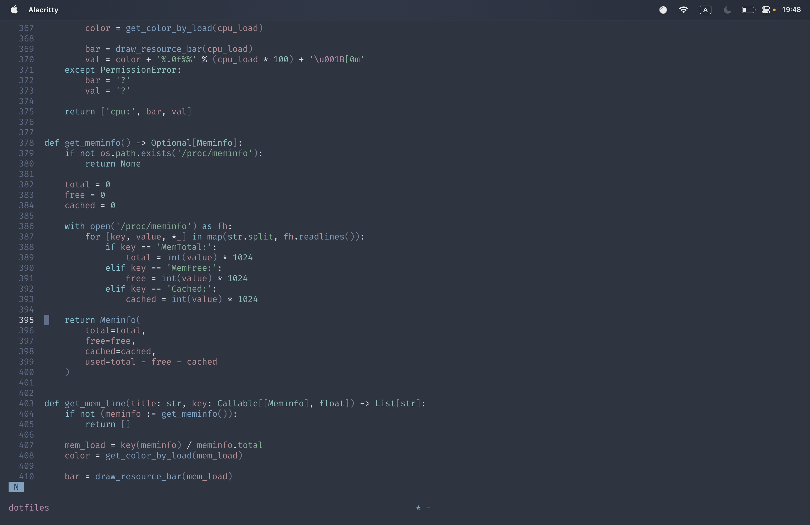

# Coding Jerk's dotfiles

Personal dotfiles.

*Helix editor in tmux in alacritty*

## Read first

1. This dotfiles created for personal use. Install on your machines at your own risk. Better read them to get inspiration.
1. All files located directly in the repository root due to XDG Base Directory Specification. Where is only single dotfile in home directory: `.pam_environment` (or `.zshenv` on MacOS).

## Structure

- `$HOME`
  1. `dotfiles` – this repository
    1. `config` stands for `$XDG_CONFIG_HOME`
    1. `share` stands for `$XDG_DATA_HOME`
    1. `bin` contains executables (mainly wrappers and custom scripts) which need to be used as commands
    1. `assets` contains wallpaper(s) and color scheme(s)
    1. `third-party` contains some useful plugins and tools which should be installed as user
    1. `tools` contais scripts which should not be accessable via PATH, such as installation script
  1. `.pam_environment` – file necessary to set up environment variables in actual system (needed to make programs search for their config files in `~/dotfiles` directory)
  1. (MacOS only) `.zshenv` – file with same purposes, but for MacOS, due to pam_env module is not supported here

## Installation

### Automatic

`curl 'https://gitlab.com/codingjerk/dotfiles/-/raw/master/tools/one-command-install.sh' | sh`

*You might want to create a new user:*

`useradd -m -G sudo,users -k /dev/null -s /bin/zsh cj`

### Semi-manual

1. `git clone <repo>`
1. `zsh dotfiles/tools/check-dependencies.zsh all` – install all listed stuff manually and run check again
1. `zsh dotfiles/tools/install.zsh`
1. `chsh $USER` – choose zsh as your shell
1. (optional) repeat installation steps for root user

## Dependencies

**Dependencies are listed in `tools/check-dependencies.zsh` script that also can automate dependency check**

## Third-party files

- Wallpaper (by Ales Krivec @aleskrivec)
- Plugins
  - Zsh
    - Fast syntax highlighting
    - Autosuggestions
    - Alias tip
