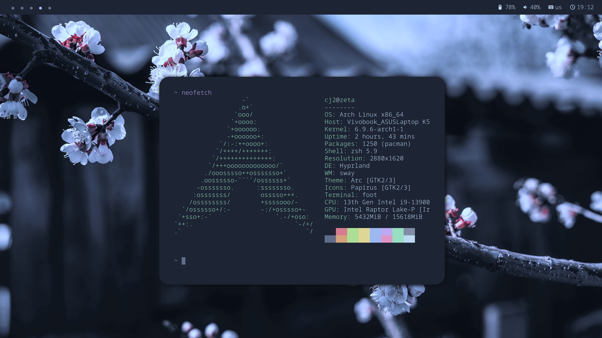

# Dotfiles

> Configuration of software I personally use for software development


*Hyprland with foot terminal, tmux and neovim*

## Install

1. Add user:

```sh
useradd -m -G docker,systemd-journal,users,wheel -k /dev/null -s /usr/bin/zsh cj
sudo -iu cj
```

2. Clone the repository

```sh
git clone https://github.com/codingjerk/dotfiles.git
```

3. Install the config files into your system

```sh
python ~/dotfiles/tools/render install
```

4. Check for missing dependencies:

```sh
python ~/dotfiles/tools/doctor
```

5. Enable systemd services and timers:

```sh
systemctl --user daemon-reload
systemctl --user add-wants niri.service \
  gammastep.service \
  hypridle.service \
  waybar.service \
  mako.service \
  foot-server.service \
  cliphist.service \
  swaybg.service \
  remind.service

systemctl --user enable --now ssh-agent.socket
systemctl --user enable --now battery.timer
systemctl --user enable --now disk.timer
systemctl --user enable --now break-reminder.timer
systemctl --user enable --now systemd-status.timer
systemctl --user enable --now network-status.timer
systemctl --user enable --now random-thai-word.timer
```

**WARNING:** This repository is tailored for my personal use.
I don't recommend installing it on your machine.

If you're not me (lol), just clone this repository and browse the configuration files.

### Optional extra steps (on new hosts)

1. Generate ssh keys:

```sh
ssh-keygen -t ed25519
```

2. Import gpg keys:

```sh
gpg --import <key>.gpg
gpg --edit-key <key-id>
# trust, 5, save
```

3. Initialize stores:

```sh
git clone cj:private-pass .password-store
git clone cj:ledger-private .ledger
git clone cj:notes-private notes
```

4. Install LSPs for `neovim`

5. Install `lazy.nvim`:

```sh
mkdir -p ~/.local/share/nvim/lazy
cd $_
git clone https://github.com/folke/lazy.nvim.git

nvim
:Lazy Install
```

## Update (re-render configuration files)

Pull sources and re-render configs:

```sh
git pull
python ~/dotfiles/tools/render install
```

## How it works

This repository contains:

- `config` -- configuration files and templates
- `settings.toml` -- color palette and per-host settings
- `wallpaper.png` -- a wallpaper
- `tools`
   - `render` -- tool to render templates into configuration files
   - `doctor` -- tool to report missing dependencies
- `scripts` -- helper scripts

The repository can be placed anywhere in your home directory.

Running `python <DOTFILES>/tools/render install` will render the configuration files and place it to the correct locations under your home directory.
