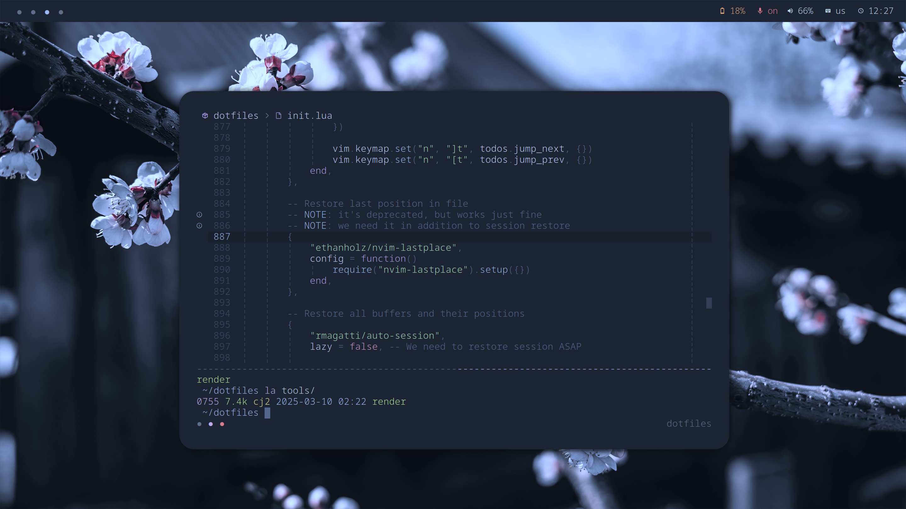

# Dotfiles

> Configuration of software I personally use for software development


*Hyprland with foot terminal, tmux and neovim*

## Install

Add user:

```sh
useradd -m -G docker,systemd-journal,users,wheel -k /dev/null -s /usr/bin/zsh cj
```

Clone repository and install dotfiles as a new user:

```sh
sudo -iu cj
git clone https://github.com/codingjerk/dotfiles.git
python ~/dotfiles/tools/render install
```

**WARNING:** it's for me and myself only,
I don't recommend to run it on your own machines.

If you're not me (lol), just clone this repository and
poke into configuration files (it's in `config` directory!).

### Optional extra steps (on new hosts)

1. Generate ssh keys:

```sh
ssh-keygen -t ed25519
```

2. Import gpg keys:

```sh
gpg --import <key>.gpg
gpg --edit-key <key-id>
# trust, 5, save
```

3. Initialize stores:

```sh
git clone <repo> .password-store
git clone <repo> .when
git clone <repo> .ledger
git clone <repo> notes
```

4. Install LSPs for `helix`.
   Check `helix`'s `language.toml` for actual sources
   and build instructions.

## Update (re-render configuration files)

Pull sources and re-render configs:

```sh
git pull
python ~/dotfiles/tools/render install
```

## How it works?

This repository contains:

- `config` -- a bunch of configuration files and templates. Main directory here
- `settings.toml` -- configurable settings (color palette, font, etc.), used by templates
- `wallpaper.png` -- a wallpaper
- `tools`
   - `render` -- tool to render templates into configuration files

Itself, repository should be placed somewhere in your home directory,
and after running `update` it will place rendered configuration files
into your home directory.
